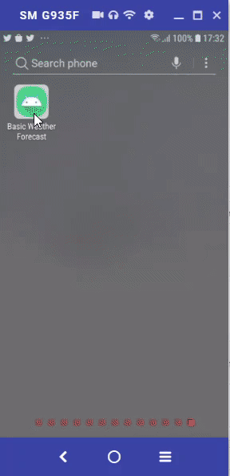

## Basic Weather Forecast
Kotlin Basic Weather Forecast mobile application with ReactiveX and Dependencies injection, etc.
Project of assignment for senior android developer position (Kotlin).

## Screenshots


##  Goal
The goal of this assignment is to assess your skills and knowledge of following topics:

* Mobile development basics
* Design pattern and frameworks
* API and data handling
* Software quality


## Tech/framework used
a. Develop application with Kotlin language.
b. Design pattern with AAC, MVVM, Clean Swift, etc.
c. Navigation Component.
d. Dependencies injection (Dagger2, Koin)
e. Using ReactiveX (RxJava, RxKotlin) or LiveData

```sh
dependencies {
    ...
    // ReactiveX
    implementation "io.reactivex.rxjava2:rxjava:$rxjava_version"
    implementation "io.reactivex.rxjava2:rxkotlin:$rxkotlin_version"
    implementation "io.reactivex.rxjava2:rxandroid:$rxandroid_version"

    // Dependencies injection
    implementation "org.koin:koin-android:$koin_version"
    implementation "org.koin:koin-androidx-viewmodel:$koin_version"

    // Retrofit2
    implementation "com.squareup.retrofit2:retrofit:$retrofit2_version"
    implementation "com.squareup.retrofit2:converter-gson:$retrofit2_version"
    implementation "com.squareup.retrofit2:adapter-rxjava2:$retrofit2_version"

    // Picasso
    implementation "com.squareup.picasso:picasso:$picasso_version"

    // Anko
    implementation "org.jetbrains.anko:anko:$anko_version"

    // Kotlin
    implementation "androidx.navigation:navigation-fragment-ktx:$nav_version"
    implementation "androidx.navigation:navigation-ui-ktx:$nav_version"

    // Dynamic Feature Module Support
    implementation "androidx.navigation:navigation-dynamic-features-fragment:$nav_version"

    // Testing Navigation
    androidTestImplementation "androidx.navigation:navigation-testing:$nav_version"

    implementation "com.github.mancj:MaterialSearchBar:$searchbar_version"
    implementation "com.label305:asynctask:1.1.0"
    implementation 'com.google.code.gson:gson:2.8.5'
    ...
}
```

## API Reference
[Current weather data](https://openweathermap.org/current)
Access current weather data for any location on Earth including over 200,000 cities!

[One Call API](https://openweathermap.org/api/one-call-api)
The One Call API provides the following weather data for any geographical coordinates:
* Current weather
* Minute forecast for 1 hour
* Hourly forecast for 48 hours
* Daily forecast for 7 days
* Historical weather data for the previous 5 days

## How to use?
1. Download code from <https://github.com/CrayJThiemsert/BasicWeatherForecast>.
2. Extract zip file from 1) to your machine.
3. Open Android Studio, choose menu "Import project (Gradle, Eclipse, ADT, etc.)". And select the directory that extract file from 2).
4. Wait for loading project files completed.

## Recommendation for future
1) In case that we would like to make the App do realtime auto update. We might be use implement "Websockets" on the server side.
2) For 7 days or more forecast, now it belong to openweathermap. We can use the code to reuse in this case.
3) Please be careful about search by non English city name.

## Test user credential
You can sign up and get free forecast from
https://home.openweathermap.org/users/sign_up
